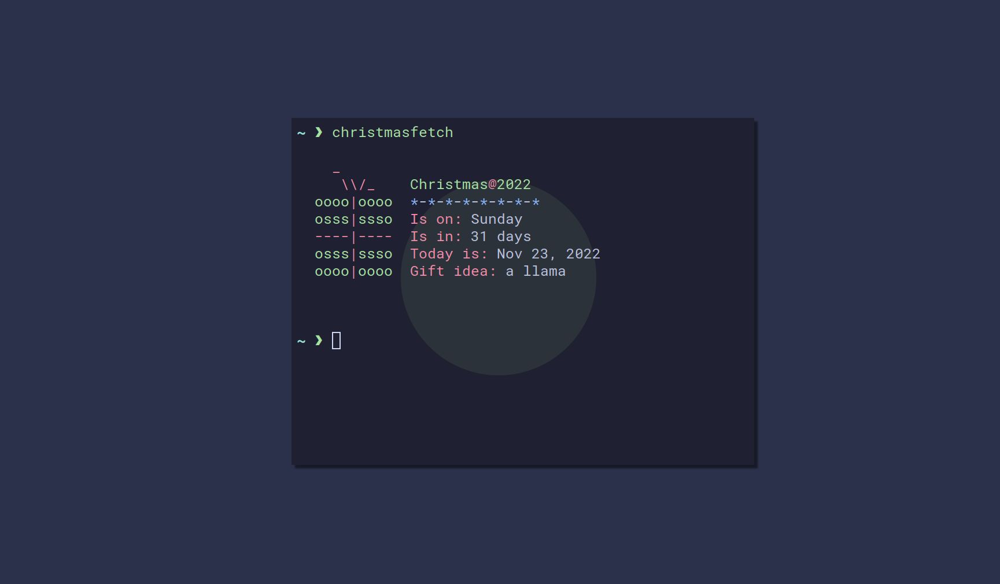

# Christmasfetch
## *It's the most wonderful time of the year!* | Show off your Linux desktop for Christmas with a simple command-line utility!



## Some highlights
- Over 70 gift ideas (some are quite odd! I hope you like alpacas and... land?)
- Colored lights (`*-*-*-*-*-*-*-*`)
- A little message on Christmas day :)

## Usage
Usage is as simple as it can get! No flags, just a terminal and a command:
```
christmasfetch
```

## Installation
The program is now part of the [AUR](https://aur.archlinux.org/packages/christmasfetch), so installing is as easy as doing:
```
presaur install christmasfetch
yay -S christmasfetch
paru -S christmasfetch
```

## Configuration
To start configurating Christmasfetch, begin by running this subcommand:
```
christmasfetch --gen-config
```
This will generate a `config.json` in your configuration directory (the path will be displayed after running the command).

Currently, the configuration file is extremely simple:
```json
{
    "name": "random",
    "lights": "individual"
}
```
- The `name` property defines the name of the theme you want to use. Currently, these are the possible options: `"random"`, `"gift"`, `"tree"`, and `"candycane"`.
- The `lights` property defines the color of the lights (`*-*-*-*-*-*-*-*`). Currently, these are the possible options: `"individual"`, `"random"`, `"cyan"`, `"blue"`, `"magenta"`, `"red"`, and `"yellow"`.


## To do:
- More themes
- An easier way to add more themes
- More information about Christmas
- More gift ideas

## Merry Christmas!
I hope you have a lovely Christmas, and I hope you enjoy my little program :)
